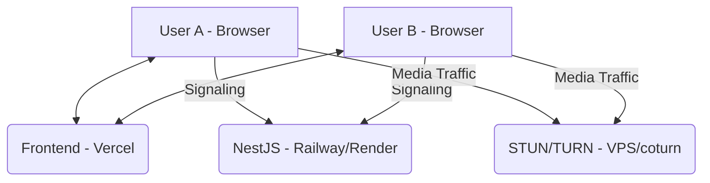

# Production Architecture Guide

To deploy Meetify effectively, especially considering Vercel's limitations with long-running WebSockets, the following architecture is recommended.

## Why Vercel doesn't support Socket.io
Vercel's serverless functions have a maximum execution time (usually 10-60s) and are stateless. Socket.io requires a persistent, stateful connection between the client and server to manage signaling and room states. Serverless functions spin down after execution, breaking the WebSocket connection.

## Recommended Stack

### 1. Frontend: Vercel
- **Platform**: [Vercel](https://vercel.com)
- **Role**: Hosts the React/Vite application. Use Vercel for its excellent CI/CD and edge caching for static assets.
- **Config**: Set environment variables (e.g., `VITE_SIGNALING_SERVER`) in the Vercel dashboard.

### 2. Signaling Server: Railway / Render / Fly.io
- **Platform**: [Railway](https://railway.app), [Render](https://render.com), or [Fly.io](https://fly.io)
- **Role**: Hosts the NestJS backend. These platforms support persistent processes and WebSockets out of the box.
- **Scalability**: These platforms allow you to scale your signaling server more easily than a traditional VPS for small to medium loads.

### 3. TURN/STUN Server: DigitalOcean / Linode (VPS)
- **Platform**: [DigitalOcean Droplet](https://digitalocean.com) or similar VPS.
- **Role**: Running a `coturn` server.
- **Why**: While public STUN servers (like Google's) work for most cases, **TURN servers** are strictly required when participants are behind symmetric NATs or restrictive corporate firewalls. Hosting your own `coturn` instance ensures privacy and reliability.

## Deployment Diagram

